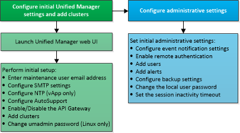

= Informationen zur Konfigurationsreihenfolge in Active IQ Unified Manager
:allow-uri-read: 
:icons: font
:imagesdir: ../media/

[role="lead"]
Der Konfigurations-Workflow beschreibt die Aufgaben, die Sie ausführen müssen, bevor Sie Unified Manager verwenden können.

