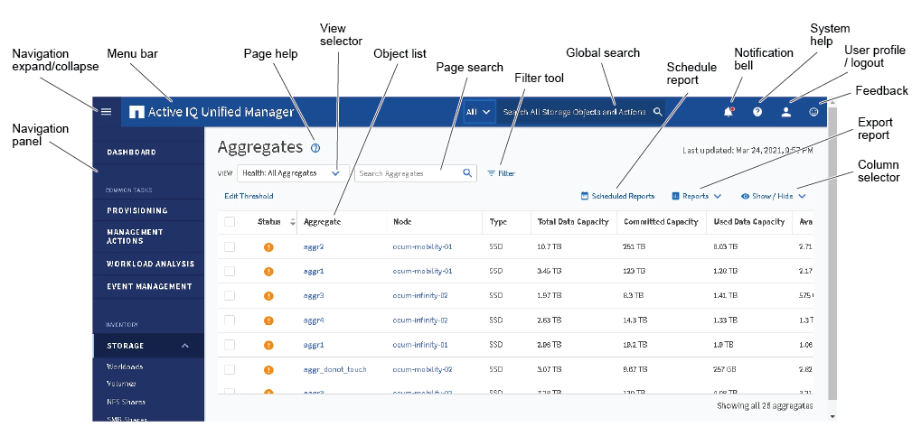

= Typische Fensterlayouts
:allow-uri-read: 
:icons: font
:imagesdir: ../media/

[role="lead"]
Das Verständnis der typischen Fensterlayouts hilft Ihnen, Active IQ Unified Manager effektiv zu nutzen und zu navigieren. Die meisten Unified Manager-Fenster ähneln einem von zwei allgemeinen Layouts: Objektliste oder Details. Die empfohlene Bildschirmeinstellung beträgt mindestens 1280 x 1024 Pixel.

Nicht jedes Fenster enthält jedes Element in den folgenden Diagrammen.

[[object-list-window-layout]]
== Layout des Fensters Objektliste

[[object-details-window-layout]]
== Layout des Fensters „Objektdetails“

image::../media/object_details.gif[Ein Screenshot, der ein Active IQ Unified Manager Volumendetails-Fenster mit Registerkarten, Kapazitätsdetails, zugehörigen Objekten, Verlauf und Ereignissen zeigt]
